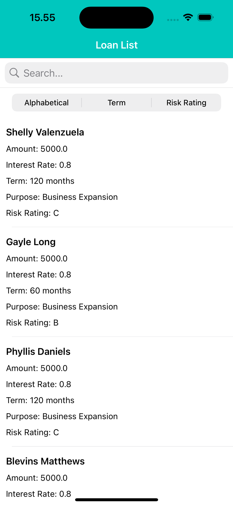
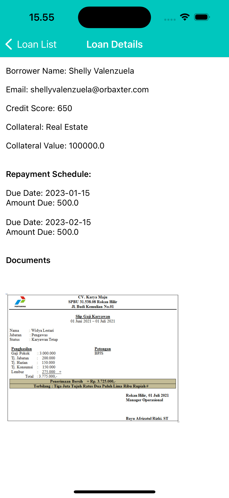

# Loan Managemenet App

## Overview
This project is an iOS Developer Test where it is a simple iOS application that displays a list of loans fetched from an API. It allows the users to searc for loans, sort them alphabetically, by term, or by risk rating, and view detailed information about each loan.

## Screenshots

### Loan Lists Screen

The screenshot above is the list of loans on the Loan Management app. Here are the key elements:

1. **Navigation Bar**: The navigation bar at the top has a mint background with a white title "Loan List". 
2. **Search Bar**: Just below the navigation bar, there is a search bar where users can enter text to search for specific loans.
3. **Filter Segmented Control**: Below the search bar, there is a segmented control with three options: Alphabetical, Term, and Risk Rating. Users can tap on these to sort the list of loans.
4. **Loan List**: The list of loans is displayed below the segmented control. Each loan item shows the borrower's name, amount, interest rate, term, purpose, and risk rating.

### Loan Details Screen

The screenshot above is the loan details when user click a list. Here are the key elements:

1. **Navigation Bar**: The navigation bar at the top has a mint background with a white title "Loan Details" and a white back button to navigate back to the loan list.
2. **Loan Information**: Detailed information about the selected loan, including:
    - Borrower Name
    - Email
    - Credit Score
    - Collateral Type
    - Collateral value
3. **Repayment Schedule**: A section displaying the repayment schedule with due dates and amounts due.
4. **Documents**: A section displaying related documents, such as pay slips.

## Features
- **Fetch Loans:** Retrieve loan data from a remote API.
- **Search Loans:** Filter loans by borrower name, amount, or purpose.
- **Sort Loans:** Alphabetically, by term (in months), or by risk rating.
- **MVVM Architecture:** Separation of UI (`LoanListViewController`) and business logic (`LoanListViewModel`).
- **Networking:** Uses `URLSession` for API requests and `Codable` for JSON parsing.
- **Error Handling:** Basic handling for network failures and API errors.
  
## Architecture
This project follows the Model-View-ViewModel (MVVM) design pattern:
- **Model:** `LoanList`, `LoanViewModel`, `Borrower`, `Collateral`, `Document`, `RepaymentSchedule`.
- **View:** `LoanListTableViewCell`, `LoanDetailViewController`, `LoanListViewController`, `PopupImageViewController`.
- **ViewModel:** `LoanListViewModel`.

## Getting Started
1. Clone the repository:
2. Open `LoanManagement.xcodeproj` in Xcode.
3. Build and run the project on a simulator or a physical device.
